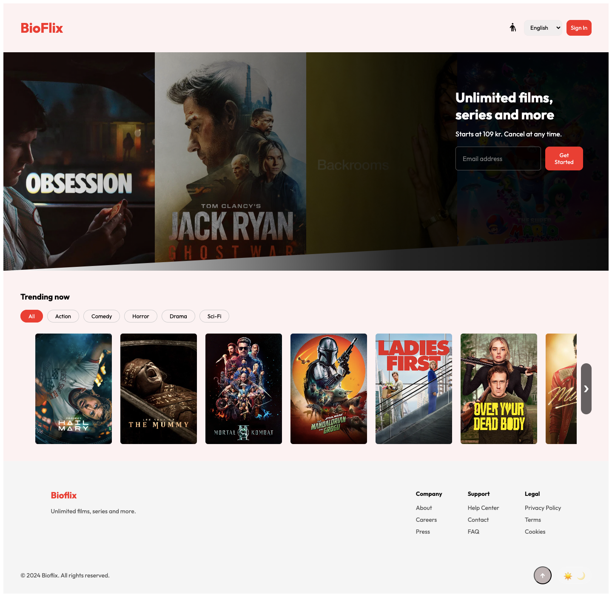

# BioFlix 🎬

A Netflix-inspired movie discovery app built with HTML, CSS, and vanilla JavaScript.
Live movie data is fetched from the TMDB API.

##  Preview


## Features

-  **Trending Movies** — fetches live weekly trending data from TMDB
-  **Genre Filter** — filter movies by Action, Comedy, Horror, Drama, Sci-Fi
- **Movie Modal** — click any card to see poster, rating, and overview
-  **Dark / Light Mode** — theme toggle with system preference detection
-  **Skeleton Loading** — shimmer placeholders while content loads
-  **Email Validation** — real-time validation with UX error states
-  **Responsive Design** — works on mobile and desktop
-  **Accessibility** — aria-labels, keyboard-friendly buttons
-  **Scroll to Top** — button appears after scrolling down

## Built With

- HTML5
- CSS3 (custom properties, grid, flexbox, animations)
- Vanilla JavaScript (async/await, DOM manipulation)
- [TMDB API](https://www.themoviedb.org/documentation/api)
- Google Fonts — Outfit

## Getting Started

1. Clone the repo
```bash
   git clone https://github.com/prasoons97/BioFlix.git
```

2. Open `index.html` in your browser — no build tools needed!

>  The TMDB API token is included for demo purposes.
> For production use, move it to an environment variable.

##  Author

Made by [Prasoon Singh](https://github.com/prasoons97)

---

> This project was built for learning and portfolio purposes.
> Movie data provided by [TMDB](https://www.themoviedb.org/).